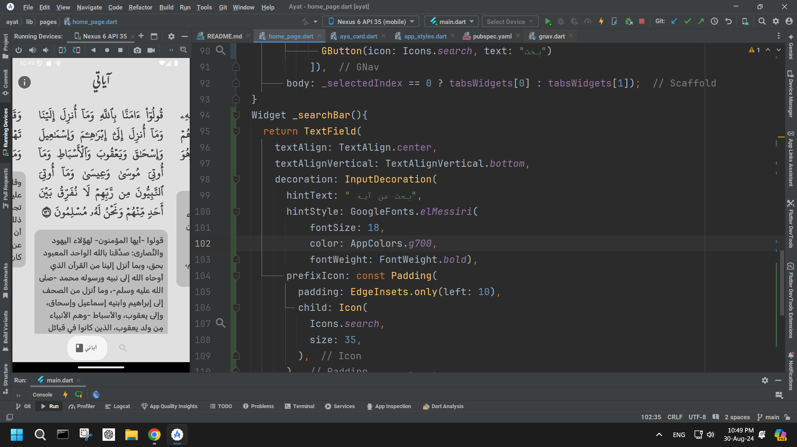
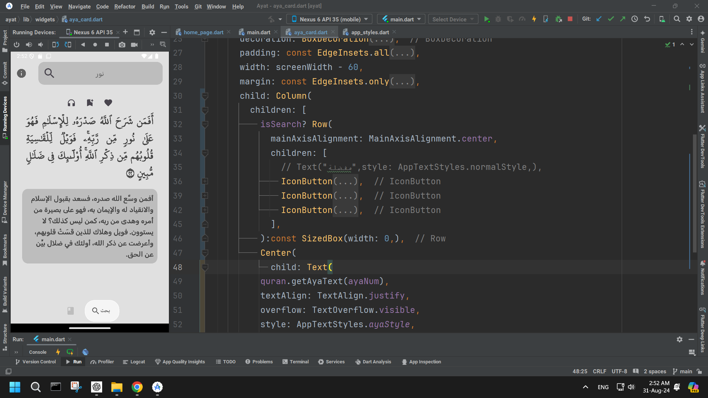

# ayat
A simple Flutter app to collect, organize, and quickly access your favorite ayat in one place.
I am using my own offline api to fetch the ayat data.

### Features
- Mark and organize your favorite ayat for quick access
- Search for ayat
- using my own offline api to fetch the ayat data.

### Example Images

